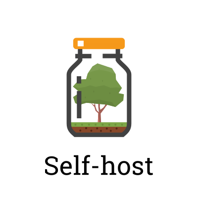

    
     
     
    <quote>&ldquo;If you want something done, do it yourself.&rdquo;</quote>
     
    <i>- A lot of people</i>

---

# Self-host by NODA

Roll your own NODA API compatible server and host the data yourself.

Made in Sweden :sweden: by skilled artisan software engineers.

# The purpose of this project

To provide clients and potential clients with an alternative platform where they are responsible for hosting the API server and the data store.

# Features

- Small infrastructure.
    + The only dependency is on PostgreSQL.
- Compiled binaries (Go).
- Designed to scale with demand.
    + Domain can be hosted on separate PostgreSQL DBMS.
    + You can scale the Self-host API to as many instances as you require.
    + The Program Manager and its Workers can be scaled as needed.
- Can be hosted in your environment.
    + No requirement on any specific cloud solution.
- It is Free software.
    + License is GPLv3.
    + The API specification is open, and you can implement it if you don't want to use the existing implementation.

# Overview

A typical deployment scenario would look something like this;

![Overview][fig1]

- One or several instances of the Self-host API server.
- One instance of the Program Manager.
- One or server instances of the Program Worker.
- One DBMS to host all Self-host databases (Domains).

# Project structure

- `api`:
    + `selfserv`: REST API interface for the Self-host main API server.
    + `selfpmgr`: REST API interface for the Program Manager.
    + `selfpwrk`: REST API interface for the Program Worker.
- `cmd`:
    + `selfctl`: Self Control; self-host CLI program.
    + `selfserv`: Self Server; self-host main API server.
    + `selfpmgr`: Self Program Manager; self-host Program Manager.
    + `selfpwrk`: Self Program Worker; self-host Program Worker.
- `docs`: Documentation
- `internal`:
    + `services`: Handlers for interfaces to the PostgreSQL backend.
    + `errors`: Custom errors.
- `middleware`: Middleware used by HTTP Servers.
- `postgres`:
    + `migrations`: Database schema.
    + `queries`: Database queries.

# Five minute deployment

Skills required;

- Good knowledge of Docker
- Some knowledge of PostgreSQL
- Some knowledge of GNU+Linux and/or Unix environments in general.

Hardware and software required;

- Computer with Docker installed

Steps:

1) ...
2) ...
3) Profit!

# Documentation

- [Glossary](docs/glossary.md)
- [Tools of the Trade](docs/tools_of_the_trade.md)
- [Design](docs/design.md)
- [Resource Requirements](docs/resource_requirements.md)
    + Rate Control: It's own section with explanation and pitfalls. golang.org/x/time/rate
- [Performance Test](docs/performance_test.md)

:hearts: Like this project? Want to improve it but unsure where to begin? Check out the [issue tracker](https://github.com/self-host/self-host/issues).

[fig1]: docs/assets/overview.svg "Overview"

